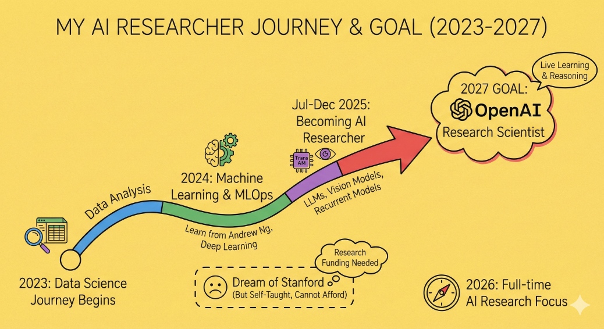

# Hi there, I'm Sumit! 👋

### 🤖 AI/ML Engineer & Researcher

I am passionate about building end-to-end generative AI applications and research tools. My work focuses on model ablation testing, LLM training pipelines (Pretraining, SFT, RLHF), and deploying scalable ML architectures.

---

### 🛠️ Tech Stack

* **Languages:** Python, SQL
* **Deep Learning:** PyTorch, TensorFlow
* **LLM & NLP:** Hugging Face (Transformers, Datasets, Spaces), LangChain, LangGraph
* **Deployment & Backend:** FastAPI, Docker, Next.js/React
* **Tools:** Git

---

### 🔭 What I'm Currently Working On

* **Unified AI Research Dashboard:** A comprehensive tool for performing holistic ablation testing and model understanding for deep learning models.
* **End-to-End LLM Training:** Building a professional-grade pipeline for training Language Models from scratch, including SFT and RLHF implementation.

---

### 💼 Open for Opportunities

I am currently looking for roles in **Machine Learning Engineering** or **AI Research**. I specialize in creating deployment-ready code and translating research concepts into production applications.

<!-- * **Portfolio:** [Link to your portfolio/website] -->
* **LinkedIn:** [[Link to your LinkedIn](https://www.linkedin.com/in/sumitkumar-airesearcher/)]
* **Email:** [sumitrwk@gmail.com]

---

### ⚡ Fun Fact
I don't just train models; I build the tools to understand *why* they behave the way they do.